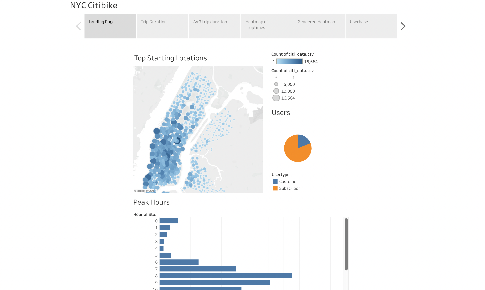
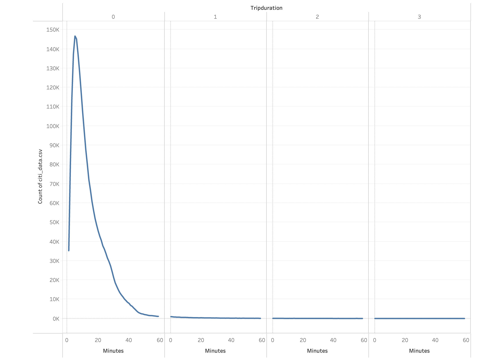
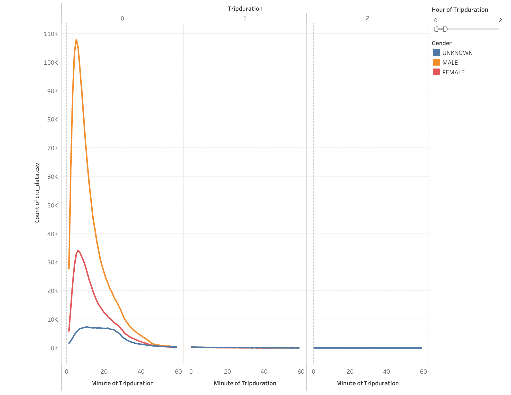
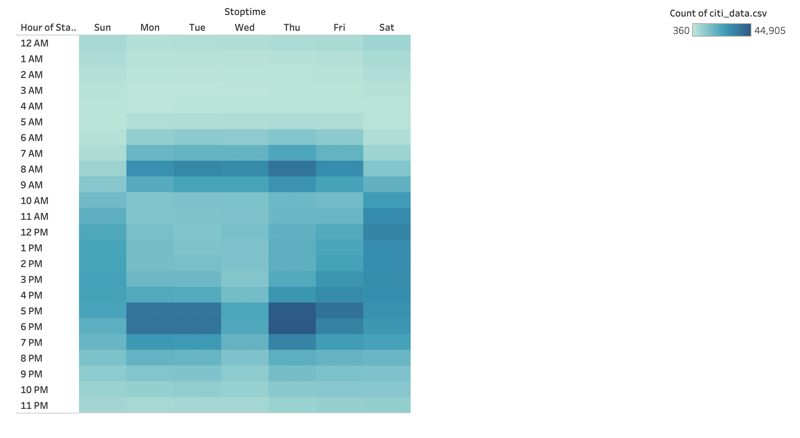
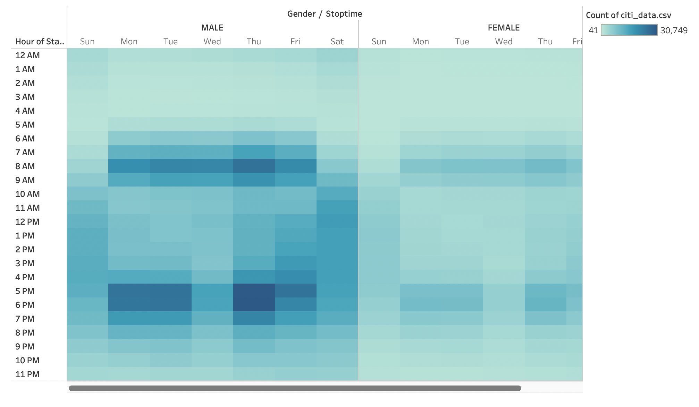
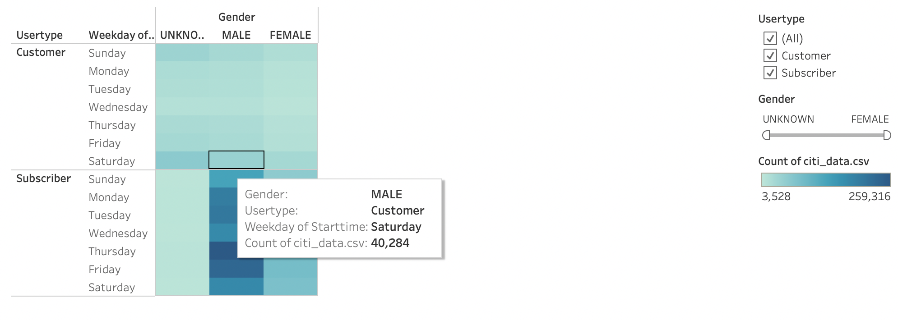

# BikeSharing
For this project, the data from the Citi Bike program in New York City will help provide an analysis for the trends recorded.

## Tableau Visualizations
You can use the [Link to Tableau Public](https://public.tableau.com/app/profile/jonah.rahn/viz/NYCBIke/NYCCitiBike?publish=yes) to navigate and preview the content from the interactive dashboard to display the visualizations in story form.

## Resources
- 201908-citibike-tripdata.csv
- NYC_CitiBike_Challenge
- citi_data.csv
--------------
- Python(Jupyter Notebook)
- Tableau

## Overview of Project:
The first portion of this challenge was to take the csv data and convert the datatypes in python to make it more accesible in Tableau. Once we have loaded the dataset into Tableau, the data can be manipulated to create visualizations and dashboards. The visualizations have been prepared to show all the sides to the business and the information that can influence decisions. The images of the visualizations below show the Citi Bike data that will help us learn the trends behind the data.

## Results:

-In this first page of the data story, highlighted up front is the map of the high traffic areas for bike use. The next visualization on the side is a pie chart showing over 75% of the trips are used by subscribers.  The third visualization is a bar chart that is used to show the most traffic amount throughout the day.

- This graph takes the data and the trip duration to find how long the average trip for all users is.

- Here we have the same graph from above yet we added a filter to split the data into the three genders of the data.

- The Heatmap above shows the hours that are the most trafficked by the cell detting darker. The most shaded cells seem to fall around the 9-5 commute times.

- Gender is the new addition to this graph as it shares most of the same visual meaning as above but shows the disparity in use.

- When we put all the gender together we see that the major customers of the product are male subscribers.

## Summary:
After we have seen all the major graphs from the data we can better understand that the majority of the trips are by subscribers while the majority are male. This allows the company to better understand their userbase and how to better meet their needs. When we look at the dataset there are many other categories that could lead to interesting ideas such as, understanding how often subscribers use the product. Other ideas to find with other datasets would be to see how often customers enroll in a subscription.
